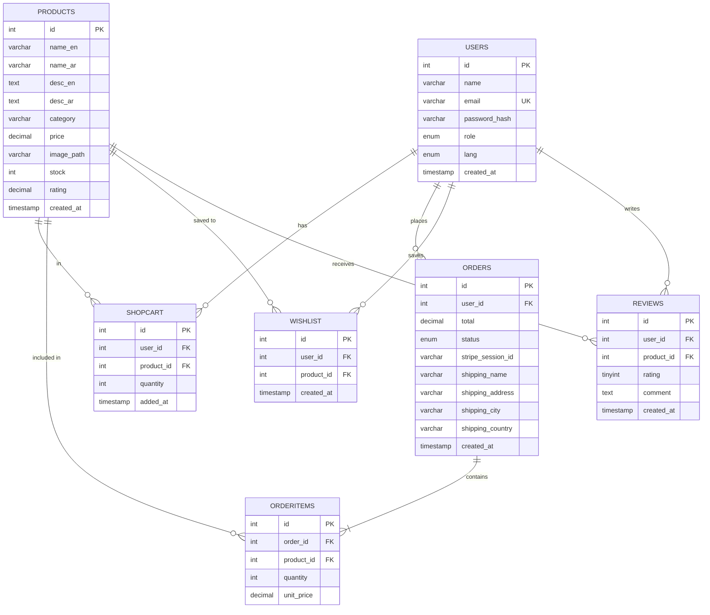

# NEON TECH – Entity Relationship Diagram (ERD)

```mermaid
erDiagram
    USERS {
        int id PK
        varchar name
        varchar email UK
        varchar password_hash
        enum role
        enum lang
        timestamp created_at
    }

    PRODUCTS {
        int id PK
        varchar name_en
        varchar name_ar
        text desc_en
        text desc_ar
        varchar category
        decimal price
        varchar image_path
        int stock
        decimal rating
        timestamp created_at
    }

    SHOPCART {
        int id PK
        int user_id FK
        int product_id FK
        int quantity
        timestamp added_at
    }

    ORDERS {
        int id PK
        int user_id FK
        decimal total
        enum status
        varchar stripe_session_id
        varchar shipping_name
        varchar shipping_address
        varchar shipping_city
        varchar shipping_country
        timestamp created_at
    }

    ORDERITEMS {
        int id PK
        int order_id FK
        int product_id FK
        int quantity
        decimal unit_price
    }

    WISHLIST {
        int id PK
        int user_id FK
        int product_id FK
        timestamp created_at
    }

    REVIEWS {
        int id PK
        int user_id FK
        int product_id FK
        tinyint rating
        text comment
        timestamp created_at
    }

    USERS ||--o{ SHOPCART    : "has"
    USERS ||--o{ ORDERS      : "places"
    USERS ||--o{ WISHLIST    : "saves"
    USERS ||--o{ REVIEWS     : "writes"
    PRODUCTS ||--o{ SHOPCART : "in"
    PRODUCTS ||--o{ ORDERITEMS : "included in"
    PRODUCTS ||--o{ WISHLIST : "saved to"
    PRODUCTS ||--o{ REVIEWS  : "receives"
    ORDERS   ||--|{ ORDERITEMS : "contains"
```
