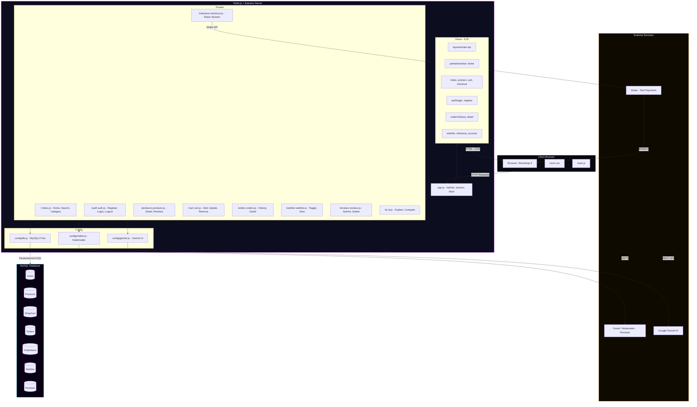

# NEON TECH – System Architecture Diagram

```mermaid
graph TB
    subgraph Client["Client Browser"]
        B["Browser / Bootstrap 5"]
        CSS["neon.css"]
        JS["main.js"]
    end

    subgraph Server["Node.js + Express Server"]
        direction TB
        APP["app.js - helmet, session, flash"]

        subgraph Routes["Routes"]
            R1["/ index.js - Home, Search, Category"]
            R2["/auth auth.js - Register, Login, Logout"]
            R3["/products products.js - Detail, Reviews"]
            R4["/cart cart.js - Add, Update, Remove"]
            R5["/checkout checkout.js - Stripe Session"]
            R6["/orders orders.js - History, Detail"]
            R7["/wishlist wishlist.js - Toggle, View"]
            R8["/reviews reviews.js - Submit, Delete"]
            R9["/ai ai.js - Explain, Compare"]
        end

        subgraph Config["Config"]
            DBC["config/db.js - MySQL2 Pool"]
            ML["config/mailer.js - Nodemailer"]
            GEM["config/gemini.js - Gemini AI"]
        end

        subgraph Views["Views - EJS"]
            V1["layouts/main.ejs"]
            V2["partials/navbar, footer"]
            V3["index, product, cart, checkout"]
            V4["auth/login, register"]
            V5["orders/history, detail"]
            V6["wishlist, checkout_success"]
        end
    end

    subgraph External["External Services"]
        STRIPE["Stripe - Test Payments"]
        GMAIL["Gmail / Nodemailer - Receipts"]
        GEMINI["Google Gemini AI"]
    end

    subgraph Database["MySQL Database"]
        direction LR
        T1[("Users")]
        T2[("Products")]
        T3[("ShopCart")]
        T4[("Orders")]
        T5[("OrderItems")]
        T6[("Wishlist")]
        T7[("Reviews")]
    end

    B -->|"HTTP Requests"| APP
    APP --> Routes
    Routes --> DBC
    Routes --> ML
    Routes --> GEM
    DBC -->|"Parameterized SQL"| Database
    ML -->|"SMTP"| GMAIL
    GEM -->|"REST API"| GEMINI
    R5 -->|"Stripe API"| STRIPE
    STRIPE -->|"Redirect"| B
    APP --> Views
    Views -->|"HTML + EJS"| B

    style Client fill:#08080f,stroke:#00f5ff,color:#e8e8ff
    style Server fill:#0d0d20,stroke:#bf00ff,color:#e8e8ff
    style Database fill:#0a0015,stroke:#00f5ff,color:#e8e8ff
    style External fill:#0f0a00,stroke:#ffae00,color:#e8e8ff
```
