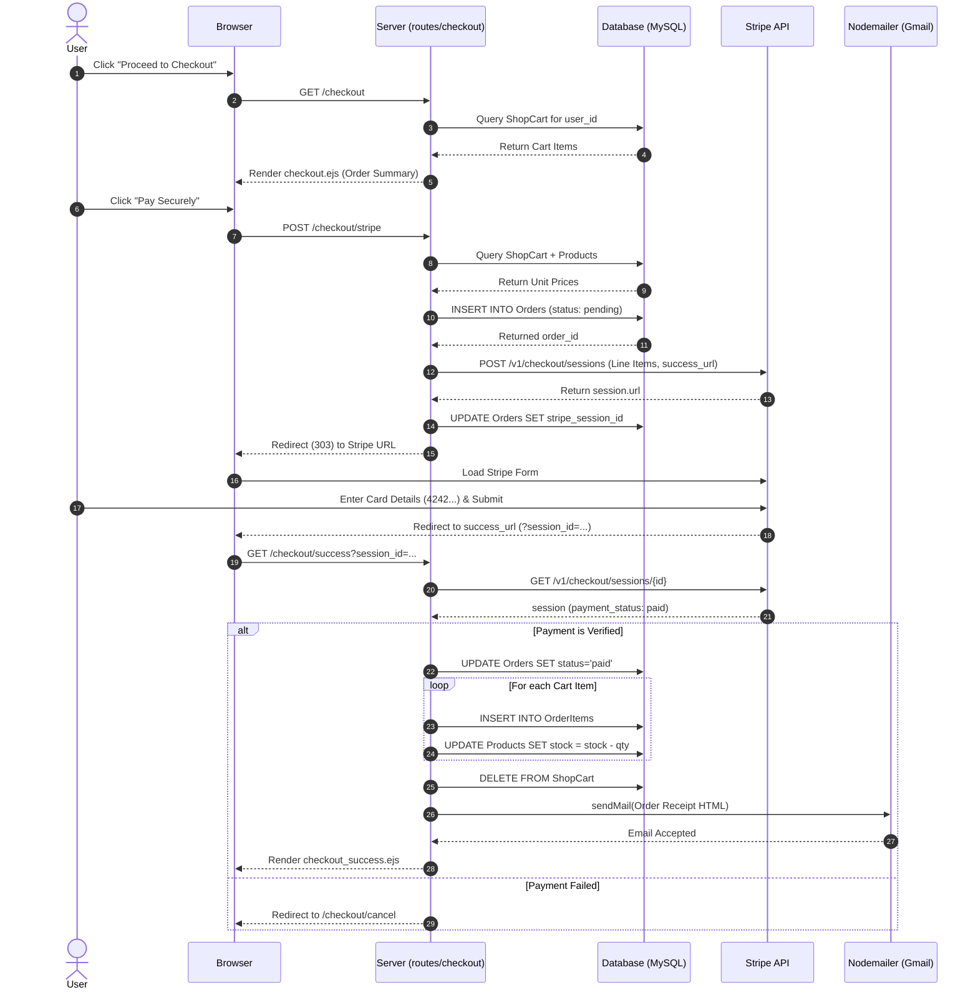

# NEON TECH – Sequence Diagram (Stripe Checkout)

```mermaid
sequenceDiagram
    autonumber
    actor User
    participant Browser
    participant Server (routes/checkout)
    participant Database (MySQL)
    participant Stripe API
    participant Nodemailer (Gmail)

    User->>Browser: Click "Proceed to Checkout"
    Browser->>Server (routes/checkout): GET /checkout
    
    Server (routes/checkout)->>Database (MySQL): Query ShopCart for user_id
    Database (MySQL)-->>Server (routes/checkout): Return Cart Items
    
    Server (routes/checkout)-->>Browser: Render checkout.ejs (Order Summary)
    
    User->>Browser: Click "Pay Securely"
    Browser->>Server (routes/checkout): POST /checkout/stripe
    
    Server (routes/checkout)->>Database (MySQL): Query ShopCart + Products
    Database (MySQL)-->>Server (routes/checkout): Return Unit Prices
    
    Server (routes/checkout)->>Database (MySQL): INSERT INTO Orders (status: pending)
    Database (MySQL)-->>Server (routes/checkout): Returned order_id
    
    Server (routes/checkout)->>Stripe API: POST /v1/checkout/sessions (Line Items, success_url)
    Stripe API-->>Server (routes/checkout): Return session.url
    
    Server (routes/checkout)->>Database (MySQL): UPDATE Orders SET stripe_session_id
    Server (routes/checkout)-->>Browser: Redirect (303) to Stripe URL
    
    Browser->>Stripe API: Load Stripe Form
    User->>Stripe API: Enter Card Details (4242...) & Submit
    
    Stripe API-->>Browser: Redirect to success_url (?session_id=...)
    Browser->>Server (routes/checkout): GET /checkout/success?session_id=...
    
    Server (routes/checkout)->>Stripe API: GET /v1/checkout/sessions/{id}
    Stripe API-->>Server (routes/checkout): session (payment_status: paid)
    
    alt Payment is Verified
        Server (routes/checkout)->>Database (MySQL): UPDATE Orders SET status='paid'
        
        loop For each Cart Item
            Server (routes/checkout)->>Database (MySQL): INSERT INTO OrderItems
            Server (routes/checkout)->>Database (MySQL): UPDATE Products SET stock = stock - qty
        end
        
        Server (routes/checkout)->>Database (MySQL): DELETE FROM ShopCart
        
        Server (routes/checkout)->>Nodemailer (Gmail): sendMail(Order Receipt HTML)
        Nodemailer (Gmail)-->>Server (routes/checkout): Email Accepted
        
        Server (routes/checkout)-->>Browser: Render checkout_success.ejs
    else Payment Failed
        Server (routes/checkout)-->>Browser: Redirect to /checkout/cancel
    end
```
