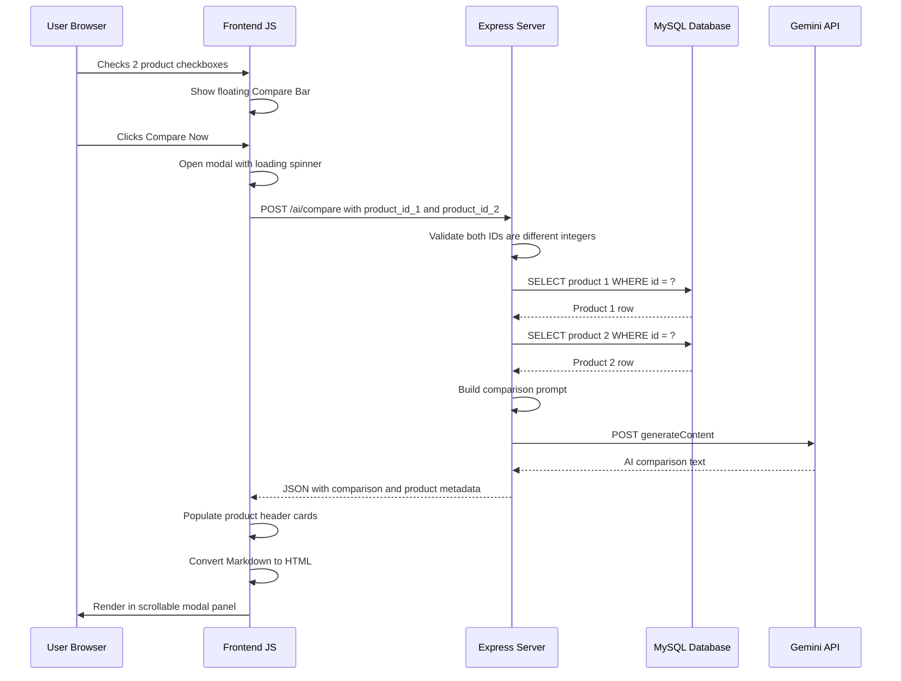

# 🤖 AI Product Comparison — Feature Documentation

## 1. Overview

The **AI Product Comparison** feature allows users to select any **two products** on the homepage and receive an intelligent, side-by-side comparison generated by **Google Gemini AI**. The AI highlights key differences, lists pros and cons for each product, and provides a final recommendation to help the user make an informed purchasing decision.

### Purpose
- **Help users decide** between two competing products.
- **Improve decision-making** with data-driven AI insights.
- **Provide interactive AI experience** that simulates real-world e-commerce comparison tools.
- **Reduce purchase hesitation** by presenting a clear winner.

---

## 2. User Flow

```
User → Checks 2 product checkboxes on homepage
     → Floating Compare Bar appears at bottom
     → Clicks "Compare Now"
     → Modal opens with loading spinner
     → System fetches both products from DB
     → Sends to Gemini API
     → Displays side-by-side comparison in modal
```

### Step-by-Step Walkthrough

1. **Browse** the homepage product grid at `/`.
2. **Check** the comparison checkbox (top-right corner) on the **first** product card.
3. The floating **Compare Bar** slides up from the bottom showing: `"{Product Name} selected — pick one more"`.
4. **Check** the checkbox on a **second** product card.
5. The Compare Bar now shows: `"{Product 1} vs {Product 2}"` and the **"Compare Now"** button becomes enabled.
6. **Click "Compare Now"**. A full-screen modal opens with a loading spinner.
7. **Wait** approximately 5–15 seconds for the Gemini API to process.
8. **View** the result: two product header cards side-by-side, and a scrollable AI comparison panel below.
9. **Close** the modal by clicking the **X** button or clicking outside the modal.
10. **Clear** selections using the "Clear" button in the Compare Bar.

---

## 3. Functional Requirements

| Requirement | Description |
|---|---|
| **Selection Method** | Checkbox on each product card (max 2) |
| **Compare Bar** | Floating bar appears when 1+ products selected |
| **Compare Button** | Enabled only when exactly 2 products are selected |
| **Input** | Both products: name, description, price, category |
| **Processing** | Server fetches both from MySQL → builds prompt → calls Gemini |
| **Output** | Key Differences, Pros/Cons, and Recommendation |
| **Display** | Full-screen modal with scrollable AI result panel |
| **Constraints** | Maximum 2 products, must exist in DB, must be different |

---

## 4. Architecture & System Flow

### 4.1 Sequence Diagram



### 4.2 Component Map

| Layer | Component | File |
|---|---|---|
| Frontend | Checkboxes, Compare Bar, Modal | `views/index.ejs` |
| Client JS | Selection manager, fetch, modal controller | `public/js/main.js` |
| Backend Route | POST `/ai/compare` endpoint | `routes/ai.js` |
| AI Engine | Gemini API with model fallback | `config/gemini.js` |
| Database | Product data source | `config/db.js` |
| Styling | Checkbox, bar, modal, spinner styles | `public/css/neon.css` |

---

## 5. AI Prompt Engineering

```
You are a product comparison expert for NEON TECH,
a premium electronics store.

Compare these two products for a customer:

Product 1: {name_en}
- Category: {category}
- Price: ${price}
- Description: {desc_en}

Product 2: {name_en}
- Category: {category}
- Price: ${price}
- Description: {desc_en}

Please provide:
1. Key Differences — The most important differences.
2. Pros and Cons — List pros and cons for each product.
3. Recommendation — Which is better and why, considering value.

Keep the tone professional and helpful. Use markdown formatting.
Limit the response to about 300 words.
```

---

## 6. Multi-Model Fallback System

Same resilient architecture as the Explain feature:

### Model Priority Order
1. `gemini-2.5-flash` (Primary)
2. `gemini-flash-latest`
3. `gemini-2.5-flash-lite`
4. `gemini-pro-latest`
5. `gemini-2.0-flash`

### Retry Strategy
| HTTP Status | Action |
|---|---|
| **429** Rate Limited | Immediately skip to next model |
| **503** Overloaded | Retry same model up to 3 times with exponential backoff |
| **Other Errors** | Skip to next model |
| **All models fail** | Return graceful error to the user |

---

## 7. UI Design

### 7.1 Comparison Checkboxes
- Positioned absolutely in the **top-right corner** of each product card.
- Hidden native checkbox with custom styled box (`.compare-check-box`).
- Unchecked: subtle border matching the card theme.
- Checked: `neon-green` border, green glow, and checkmark icon.
- On card hover: border highlights to `neon-cyan`.

### 7.2 Floating Compare Bar
- Fixed to the **bottom of the viewport** (`position: fixed; bottom: -80px`).
- Slides up with CSS transition when 1+ products are selected.
- Glassmorphism background with `backdrop-filter: blur(20px)`.
- Green top border and subtle green shadow for AI theme.
- Contains: product names text, "Clear" button, "Compare Now" button.
- "Compare Now" is a `btn-neon-filled` style, disabled until exactly 2 products selected.

### 7.3 Comparison Modal
- Full-screen overlay with `rgba(8,8,15,0.92)` backdrop and blur.
- Content card: `max-width: 750px`, `max-height: 85vh`, scrollable.
- Green border and subtle green box-shadow.
- Fade-in animation on open.
- **Close mechanisms:** X button (top-right) or clicking the backdrop overlay.

### 7.4 Modal Layout
```
┌─────────────────────────────────────────┐
│           🤖 AI PRODUCT COMPARISON       │  ← Header (Orbitron font)
├────────────────┬────────────────────────┤
│   Product 1    │      Product 2         │  ← Side-by-side cards
│   Category     │      Category          │
│   Name         │      Name              │
│   Price        │      Price             │
├────────────────┴────────────────────────┤
│        AI Comparison Result             │  ← Scrollable green panel
│  (max-height: 50vh, overflow-y: auto)   │
│  • Key Differences                      │
│  • Pros & Cons                          │
│  • Recommendation                       │
└─────────────────────────────────────────┘
```

### 7.5 Loading State
- Custom CSS spinner (`.ai-spinner`) with `neon-green` ring.
- Text: "Generating AI comparison..."
- Displayed inside the modal result panel while waiting.

---

## 8. Client-Side Logic

### Selection Management
```javascript
let selected = []; // Max length: 2

checkbox.addEventListener('change', function () {
  if (this.checked && selected.length >= 2) {
    this.checked = false; // Prevent 3rd selection
    return;
  }
  // Push or filter from selected array
  updateCompareBar(); // Update bar text and button state
});
```

### Compare Bar States
| Selected Count | Bar Text | Button State |
|---|---|---|
| 0 | Hidden (slides down) | N/A |
| 1 | `"{Name} selected — pick one more"` | Disabled |
| 2 | `"{Name1} vs {Name2}"` | **Enabled** |

### API Response Handling
The response JSON includes both the AI text and product metadata:
```json
{
  "success": true,
  "comparison": "### 1. Key Differences...",
  "product1": { "id": 1, "name": "...", "price": 199, "category": "..." },
  "product2": { "id": 2, "name": "...", "price": 349, "category": "..." }
}
```

The metadata is used to populate the product header cards in the modal without a second DB call from the client.

---

## 9. Security Considerations

| Concern | Mitigation |
|---|---|
| API Key Exposure | Key in `.env` (gitignored), never sent to client |
| Invalid IDs | Server validates both IDs as integers |
| Same product | Server rejects if `id1 === id2` |
| Missing products | Server returns 404 if either product not found |
| Prompt Injection | No user text in prompt, only DB-sourced data |
| CSP | Gemini domain whitelisted in `connectSrc` |
| Error Leakage | Generic error messages to client |

---

## 10. Error Handling

| Scenario | Response |
|---|---|
| Missing or non-numeric IDs | `400: Please select two different products` |
| Same product ID for both | `400: Please select two different products` |
| Product not found in DB | `404: One or both products not found` |
| All Gemini models fail | `500: AI service temporarily unavailable` |
| Network failure (client) | Red error text in modal |

---

## 11. Testing

### API Test
```bash
curl -X POST http://localhost:3000/ai/compare \
  -H "Content-Type: application/json" \
  -d '{"product_id_1": 1, "product_id_2": 2}'
```

### Expected Response
```json
{
  "success": true,
  "comparison": "### 1. Key Differences\n...",
  "product1": { "id": 1, "name": "NeonPods Pro", "price": 199, "category": "Audio" },
  "product2": { "id": 2, "name": "NeonSound Over-Ear", "price": 349, "category": "Audio" }
}
```

### Verification Checklist
- [ ] Checkboxes appear on all product cards
- [ ] Maximum 2 checkboxes can be selected
- [ ] Floating bar appears on first selection
- [ ] Bar text updates dynamically
- [ ] Compare Now enables only with 2 selections
- [ ] Modal opens with loading spinner
- [ ] Product header cards populate correctly
- [ ] AI comparison text renders with markdown formatting
- [ ] Result panel is scrollable for long responses
- [ ] Modal closes via X button and backdrop click
- [ ] Clear button resets all selections
- [ ] Error displays gracefully on API failure
- [ ] No API key visible in browser Network tab

---

## 12. Constraints

| Constraint | Details |
|---|---|
| Max products | 2 per comparison |
| Products must exist | Validated server-side |
| Products must differ | Same ID rejected |
| API key required | `GEMINI_API_KEY` in `.env` |
| Node.js version | 18+ required for native `fetch` |

---

## 13. Dependencies

| Package | Purpose |
|---|---|
| `dotenv` | Loads `GEMINI_API_KEY` from `.env` |
| Native `fetch` | HTTP requests to Gemini API (Node.js 18+ built-in) |

> **Note:** No additional NPM packages are required for this feature.
