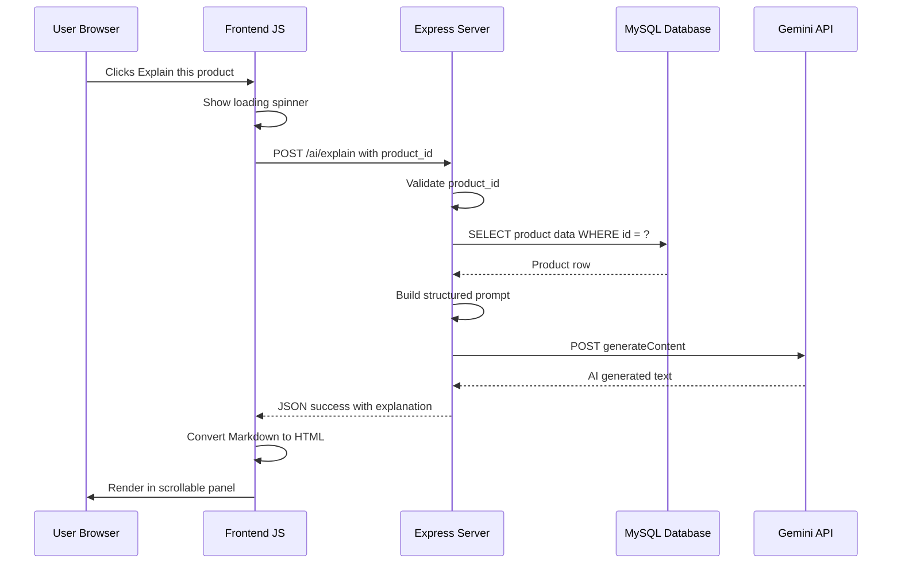

# 🤖 AI Product Explanation — Feature Documentation

## 1. Overview

The **AI Product Explanation** feature allows users to generate a simplified, user-friendly explanation of any product using **Google Gemini AI**. When a shopper encounters a technically complex product, they can click a single button to receive an instant AI breakdown that demystifies the product in plain language.

### Purpose
- **Simplify** complex technical descriptions into everyday language.
- **Improve** user understanding before making a purchase decision.
- **Enhance** the overall shopping experience with intelligent behavior.
- **Add value** by providing personalized, on-demand product insights.

---

## 2. User Flow

```
User → Opens Product Detail Page → Clicks "🤖 Explain this product"
     → System extracts product data from DB
     → Sends structured prompt to Gemini API
     → Receives formatted explanation
     → Displayed dynamically on the page in a scrollable panel
```

### Step-by-Step Walkthrough

1. **Navigate** to any product detail page (e.g., `/products/1`).
2. **Locate** the green-bordered button labeled **"🤖 EXPLAIN THIS PRODUCT"** below the Wishlist button.
3. **Click** the button. The button text changes to "⏳ Generating..." and a loading spinner appears.
4. **Wait** approximately 3–10 seconds for the Gemini API to process the request.
5. **View** the AI-generated explanation in a neon-green bordered, scrollable panel.
6. **Re-click** the button at any time to regenerate the explanation.

---

## 3. Functional Requirements

| Requirement | Description |
|---|---|
| **Trigger** | Button click: "🤖 Explain this product" |
| **Input** | Product name, description, price, category |
| **Processing** | Server fetches product from MySQL → builds prompt → calls Gemini API |
| **Output** | AI text: What It Is, Key Benefits, Who Should Buy It |
| **Display** | Scrollable neon panel with markdown-to-HTML conversion |
| **Error Handling** | Graceful fallback message if AI service is unavailable |

---

## 4. Architecture & System Flow

### 4.1 Sequence Diagram



### 4.2 Component Map

| Layer | Component | File |
|---|---|---|
| Frontend | Explain Button and Result Panel | `views/product.ejs` |
| Client JS | Click handler, fetch, markdown renderer | `public/js/main.js` |
| Backend Route | POST `/ai/explain` endpoint | `routes/ai.js` |
| AI Engine | Gemini API with model fallback | `config/gemini.js` |
| Database | Product data source | `config/db.js` |
| Styling | Loading spinner, AI panel theme | `public/css/neon.css` |

---

## 5. AI Prompt Engineering

The prompt is carefully structured for consistent output:

```
You are a friendly and knowledgeable electronics shopping assistant
for NEON TECH, a premium electronics store.

A customer wants to understand this product better:

Product Name: {name_en}
Category: {category}
Price: ${price}
Description: {desc_en}

Please provide a clear, concise explanation with these sections:
1. What It Is — A simple, jargon-free summary.
2. Key Benefits — 3-4 bullet points highlighting the main advantages.
3. Who Should Buy It — Describe the ideal customer for this product.

Keep the tone professional but approachable.
Use no more than 200 words total. Use markdown formatting.
```

---

## 6. Multi-Model Fallback System

### Model Priority Order
1. `gemini-2.5-flash` (Primary)
2. `gemini-flash-latest`
3. `gemini-2.5-flash-lite`
4. `gemini-pro-latest`
5. `gemini-2.0-flash`

### Retry Logic
| HTTP Status | Action |
|---|---|
| **429** Rate Limited | Immediately skip to next model |
| **503** Overloaded | Retry same model up to 3 times with exponential backoff |
| **Other Errors** | Skip to next model |
| **All models fail** | Return graceful error message |

---

## 7. UI Design

### Button
- Located below "Add to Wishlist" on the product detail page.
- Styled with `neon-green` border matching the AI theme.
- Full-width for visual consistency.
- Disables and shows "Generating..." during API calls.

### Result Panel
- Scrollable: `max-height: 500px; overflow-y: auto`.
- Sticky header: "AI ANALYSIS" stays visible while scrolling.
- Semi-transparent green background for visual distinction.
- Markdown converted to styled HTML with neon-colored headings.

### Loading State
- Custom CSS spinner with `neon-green` rotating ring.
- Text: "Analyzing product with AI..."

---

## 8. Security Considerations

| Concern | Mitigation |
|---|---|
| API Key Exposure | Key in `.env` (gitignored), never sent to client |
| Prompt Injection | No user-generated text in prompt, only DB data |
| CSP | `generativelanguage.googleapis.com` in `connectSrc` |
| Error Leakage | Internal errors logged server-side, generic client message |
| Rate Limiting | Multi-model fallback prevents quota exhaustion |

---

## 9. Error Handling

| Scenario | Response |
|---|---|
| Invalid `product_id` | `400: Invalid product ID` |
| Product not in DB | `404: Product not found` |
| All Gemini models fail | `500: AI service temporarily unavailable` |
| Network failure (client) | Red error text in panel |
| Empty AI response | Caught and handled by error handler |

---

## 10. Testing

### API Test
```bash
curl -X POST http://localhost:3000/ai/explain \
  -H "Content-Type: application/json" \
  -d '{"product_id": 1}'
```

### Expected Response
```json
{
  "success": true,
  "explanation": "## 1. What It Is\nThe NeonPods Pro are premium..."
}
```

### Verification Checklist
- [ ] Button appears on all product detail pages
- [ ] Loading spinner displays during API call
- [ ] AI response renders with correct markdown formatting
- [ ] Panel is scrollable for long responses
- [ ] Error message displays when API is unavailable
- [ ] Button re-enables after response
- [ ] No API key visible in browser Network tab

---

## 11. Dependencies

| Package | Purpose |
|---|---|
| `dotenv` | Loads `GEMINI_API_KEY` from `.env` |
| Native `fetch` | HTTP requests to Gemini API (Node.js 18+ built-in) |

> **Note:** No additional NPM packages are required for this feature.
